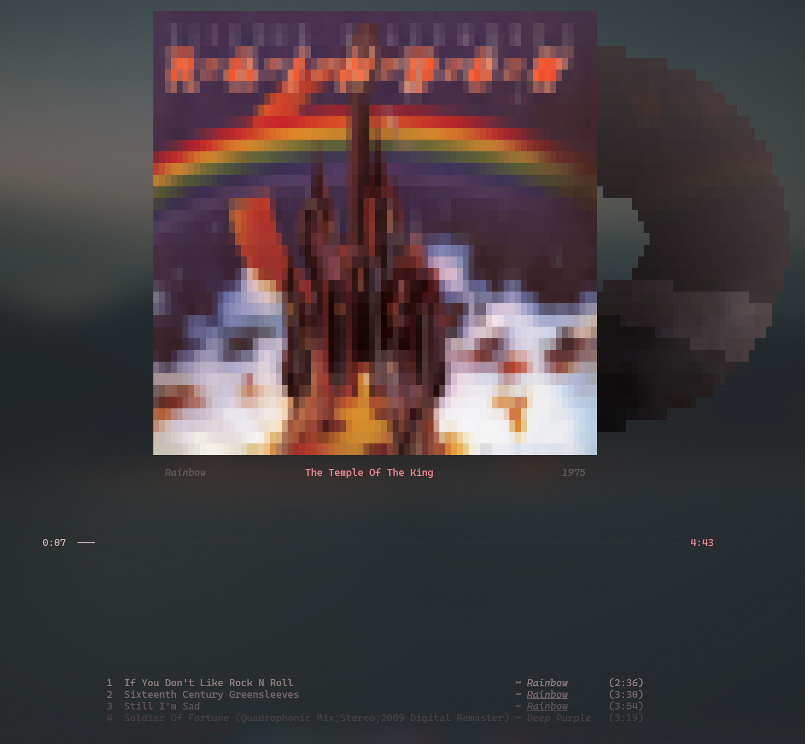

<div align="center">
    <h2>✨ Overview</h2>
</div>

<div align="center">
    <h4>YT Music Desktop APP:</h4>
    
</div>

<div align="center">
    <h4>Terminal Widget:</h4>
    
</div>

<div align="center">
    <h2>📦 Download</h2>
</div>

1. Download the custom YTMDesktop app from releases tab.

2. Clone this repository:

```bash
git clone https://github.com/7hebel/ytmusic-widget.git
cd ytmusic-widget/widget
```

(You can remove the `assets` and `ytmusic-desktop` dirs if You want.)

3. Install requirements.

```bash
pip install -r requirements.txt
```

4. Run server.

```bash
py main.py 
(or)
python3 main.py
```

<div align="center">
    <h2>📜 Changelog</h2>
</div>

#### **01/11/2025**:
* Updated disc:
  
  - It's color is now based on the cover's average color.
    
  - Shine animation is now color and distance based.
  - Fixed a few scaling bugs.

* Cover based UI colors.
  
  - UI color is based on the cover image. 
    

<div align="center">
    <h2>⚙️ Solution</h2>
</div>

The injected JS code into the YTM web app listens to the changes in predefined elements (like title, author etc.)

Injected JS code in `src/renderer/ytmview/preload.ts`

```js
function injectWidget(){
    let socket = null;
    let state_interval = null;
    let track_change_interval = null;
    let reconnectTimeout = null;

    const timeInfoElement = document.querySelector(".time-info.style-scope.ytmusic-player-bar");
    const titleElement = document.querySelector(".title.style-scope.ytmusic-player-bar");
    const coverElement = document.querySelector("ytmusic-player yt-img-shadow img");


    function onSocketFailure() {
        if (reconnectTimeout) return;

        console.log("Connection failed. Attempting to reconnect in 5 seconds...");
        clearInterval(state_interval);
        clearInterval(track_change_interval);

        reconnectTimeout = setTimeout(() => {
            reconnectTimeout = null;
            setupSocket();
        }, 5000);
    }

    function setupSocket() {
        if (socket) {
            try {
                socket.close();
            } catch (e) {
                console.warn("Error closing previous socket:", e);
            }
        }

        socket = new WebSocket('ws://localhost:50505');

        socket.addEventListener('open', (event) => {
            console.log('Connected to WebSocket server on ws://localhost:50505');
            state_interval = setInterval(sendPlayState, 1000);
            track_change_interval = setInterval(_checkTrackChange, 3000);
        });

        socket.addEventListener('message', (event) => {
            console.log('Received:', event.data);

            if (event.data == "reqTrack") {
                sendTrackUpdate();
            }

            if (event.data == "shuffle") {
                shuffleBtn.click();
                shuffleBtn.click();
            }
        });


        socket.addEventListener('close', (event) => {
            console.log('Connection closed:', event.reason);
            onSocketFailure();
        });

        socket.addEventListener('error', (error) => {
            console.error('WebSocket error:', error);
            onSocketFailure();
        });
    }

    setupSocket();

    function _sendMessageToServer(evtype, data) {
        const message = {
            event: evtype,
            data: data
        };

        socket.send(JSON.stringify(message));
    }


    function _getQueueData() {
        let arr = Array.from(document.getElementsByTagName("ytmusic-player-queue-item")).filter(e => e.parentNode.id !== "counterpart-renderer");
        let curr = arr.filter((el) => el.playButtonState !== "default" && el.playButtonState !== undefined)[0];
        return [arr, curr];
    }


    let _prevTitle = null;
    function _checkTrackChange() {
        if (!titleElement) return;

        let title = titleElement.textContent;
        if (title !== _prevTitle) {
            setTimeout(sendTrackUpdate, 3000);
        }

        _prevTitle = title;
    }


    let _prevState = null;
    function sendPlayState() {
        const [current, total] = timeInfoElement.textContent.trim().split("/");

        const data = {
            current: current.trim(),
            total: total.trim(),
        }

        if (_prevState === null || data.current != _prevState.current || data.total != _prevState.total) {
            _sendMessageToServer("play-state", data)
            _prevState = data;
        }

    }


    function sendTrackUpdate() {
        const [arr, curr] = _getQueueData();

        const startIndex = arr.indexOf(curr);
        const next5 = [];

        for (let i = 1; i <= 5; i++) {
            const item = arr[startIndex + i];
            if (!item) continue;

            const data = item.textContent.split("\\n").filter(e => e.trim());
            next5.push({
                title: data[0]?.trim() || '',
                author: data[1]?.trim() || '',
                duration: data[2]?.trim() || '',
            });
        }

        const metadataContainer = document.querySelector(".byline.style-scope.ytmusic-player-bar.complex-string")

        const data = {
            cover: coverElement?.src || '',
            title: titleElement?.title || '',
            author: metadataContainer?.children[0]?.textContent || '',
            year: metadataContainer?.children[metadataContainer.children.length - 1]?.textContent || '',
            queue: next5
        };

        _sendMessageToServer("update-track", data);
    }
  }

  setTimeout(injectWidget, 5000);
```
